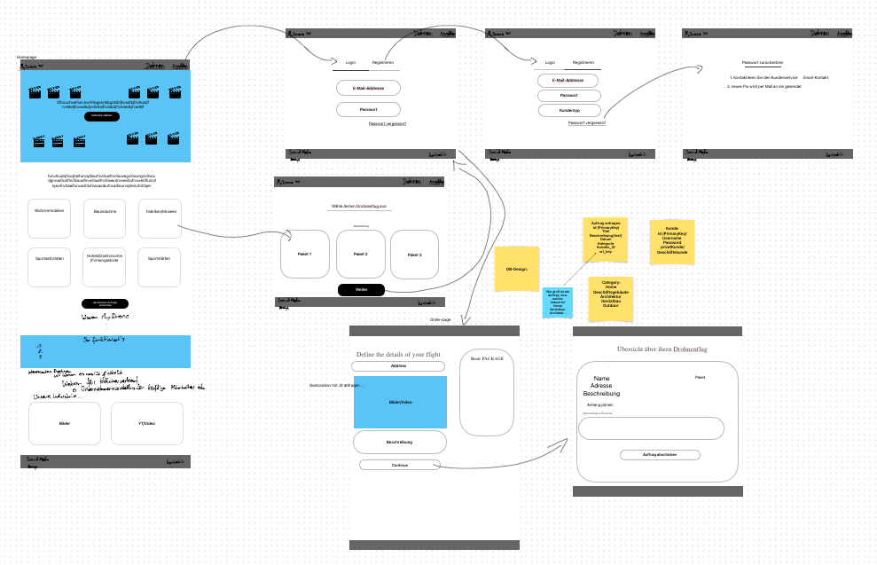

# Webentwicklung Sommersemester 23

## Command Cheatsheet

start server:

```shell
cd ./public
php -S webentwicklung.test:8000
```

start DB:

```shell
mysql.server start
```

composer install:

```shell
composer install
```

composer update:

```shell
composer update
```

dump DB:

```shell
mysqldump -u root -p schema_name > dump_file.sql
```

## Project

### Drone Service Provider

This project aims to provide a web-based platform for drone services. The platform allows users to book drone services
for their home or business. The website design is responsive, with a layout that is easy
to navigate.

### Website Design

#### Website Layout


The website design is responsive, ensuring that the layout adjusts to the size of the screen used to view it.


## Getting Started

The following sections provide an overview of how to set up the project and are essential reading.

### Install dependencies

To run this project, you must install its dependencies. We use Composer for PHP dependency management.

You can use Composer to install PHP dependencies as defined in your composer.json file. You can also update them to the
latest version that fits your requirements.

#### Install Dependencies

To install dependencies, use the following command:

```shell
composer install
```

This command installs dependencies according to your composer.lock file, generated during your first install run. This
ensures that you always get the same dependency version wherever you install. To update the composer.lock file, update
your dependencies.

To install a single (new) dependency, use the following command:

```shell
composer install vendor/mynewdependency
```

#### Update dependencies

To update a specific package, use the following command:


```shell
composer update
```

To update a specific package, use the following command:


```shell
composer update vendor/mynewdependency
```